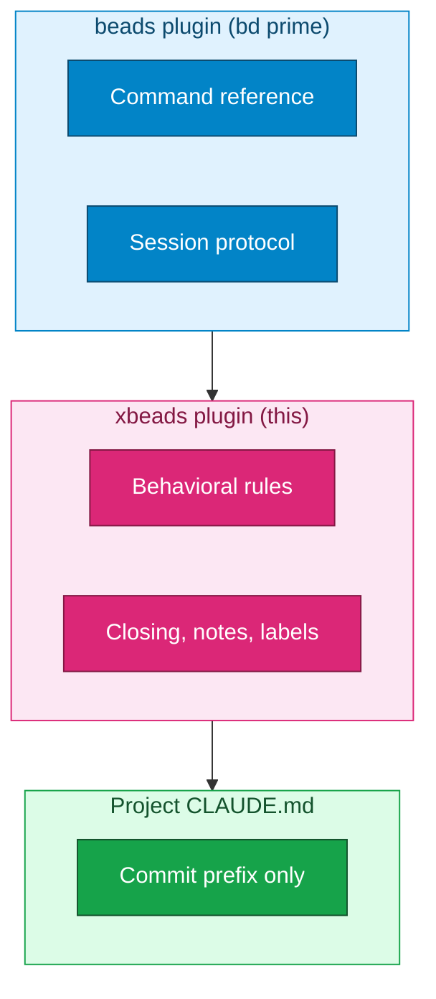

# xbeads Plugin

Extensions to [beads](https://github.com/steveyegge/beads) issue tracking.

## Requirements

- beads plugin installed (`/plugin install beads@beads-marketplace`)

## Installation

```bash
/plugin install jdillon/claude-code@xbeads
```

## Features

### Behavioral Rules (via hooks)

This plugin injects behavioral rules at session start and before compaction (only in projects with `.beads/` directory):

- **No premature closing** - wait for user verification before closing issues
- **Status updates** - set `in_progress` when starting, `blocked` when stuck
- **Append notes** - don't replace existing content, use `---` separator
- **Category labels** - add labels like `ui`, `backend`, `docs` when creating

### Commands

| Command | Description |
|---------|-------------|
| `/xbeads:dashboard` | Show in-progress tasks and ready-to-work items |

## Recommended CLAUDE.md Setup

With xbeads installed, you can keep your CLAUDE.md files minimal. The plugin handles behavioral rules automatically.

### `~/.claude/CLAUDE.md` (User Global)

No beads section needed - xbeads handles behavioral rules via hooks.

Optional: Add personal preferences not covered by the plugin:

```markdown
## Beads Preferences

- when asked to label beads for a category, analyze the bead for topics and pick the most appropriate; reuse existing labels where possible
```

### `<project>/CLAUDE.md` (Per-Project)

Only project-specific settings:

```markdown
## Beads

**Commit format**: Include `Resolves: <prefix>-xxx` or `Related: <prefix>-xxx` in commit messages.
```

Optional additions for specific projects:
- Protected branch workflow (if using worktrees)
- Project-specific labeling conventions
- Links to project beads docs

### What You Can Remove

With xbeads installed, remove these from your CLAUDE.md files (now handled by plugin):

- "Use beads MCP tools for ALL issue tracking"
- "Do NOT use TodoWrite or markdown TODOs"
- "Do NOT close issues prematurely"
- "Append new information, don't replace"
- "Add category labels when creating"

## Customization

Edit `scripts/rules.md` to customize the injected behavioral rules.

## How It Works



The beads plugin provides command reference via `bd prime`. This plugin adds behavioral rules. Your CLAUDE.md only needs project-specific settings like commit prefix.
